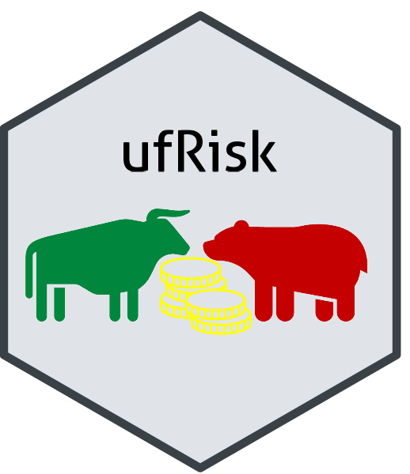
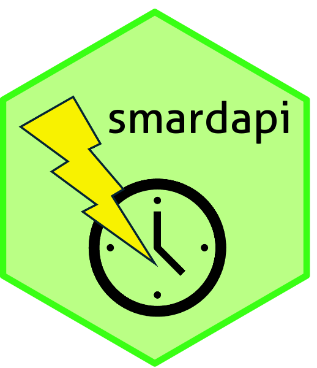
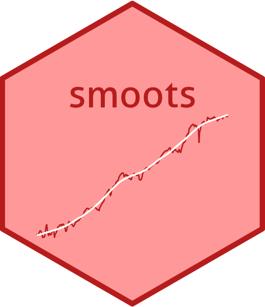
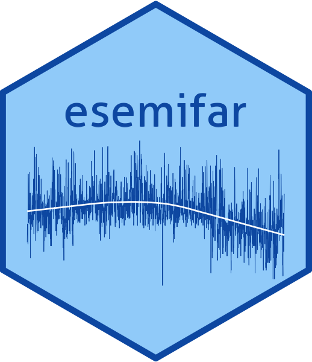
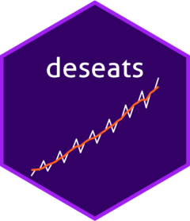

::: {#hero-heading}
Here you can find a selection of my published **software**. Download numbers refer to realized lifetime downloads by the end of Aug 30, 2026. **Note:** This page is currently under construction. While the overall information will stay the same, new HTML implementations will redesign this page strongly in the near future.
:::

## R packages

  

   

<h3>Welcome</h3> 

Move your mouse over a package icon to learn more. Click an icon to go to the package's CRAN or GitHub page.

<h3>smoots</h3>

Nonparametric Estimation of the Trend and Its Derivatives in Time Series

<dl>

<dd>Year: 2023</dd>

<dd>Authors: Feng, Y., Letmathe, S., Schulz, D. (Maintainer)</dd>

<dd>Version: 1.1.4</dd>

<dd>Available on: CRAN</dd>

<dd>Downloads: 42,988</dd>

</dl>

<h3>esemifar</h3>

Smoothing Long-Memory Time Series

<dl>

<dd>Year: 2024</dd>

<dd>Authors: Feng, Y., Beran, J., Letmathe, S., Schulz, D. (Maintainer)</dd>

<dd>Version: 2.0.1</dd>

<dd>Available on: CRAN</dd>

<dd>Downloads: 22,230</dd>

</dl>

<h3>deseats</h3>

Data-Driven Locally Weighted Regression for Trend and Seasonality in Time Series

<dl>

<dd>Year: 2026</dd>

<dd>Authors: Feng, Y., Schulz, D. (Maintainer)</dd>

<dd>Version: 1.1.2</dd>

<dd>Available on: CRAN</dd>

<dd>Downloads: 12,072</dd>

</dl>

<h3>fEGarch</h3>

Short-Memory/Long-Memory EGARCH & GARCH, VaR/ES Backtesting & Dual Long-Memory Extensions

<dl>

<dd>Year: 2026</dd>

<dd>Authors: Schulz, D. (Maintainer), Feng, Y., Peitz, C., Ayensu, O. K.</dd>

<dd>Version: 1.0.7</dd>

<dd>Available on: CRAN</dd>

<dd>Downloads: 5,461</dd>

</dl>

<h3>smardapi</h3>

Access to the SMARD API of the German Federal Network Agency

<dl>

<dd>Year: 2026</dd>

<dd>Authors: Schulz, D. (Maintainer)</dd>

<dd>Version: 0.1.2</dd>

<dd>Available on: GitHub</dd>

<dd>Downloads: ---</dd>

</dl>

<h3>ufRisk</h3>

Risk Measure Calculation in Financial Time Series

<dl>

<dd>Year: 2023</dd>

<dd>Authors: Feng, Y., Zhang, X., Peitz, C., Schulz, D., Li, S., Letmathe, S. (Maintainer)</dd>

<dd>Version: 1.0.7</dd>

<dd>Available on: CRAN</dd>

<dd>Downloads: 15,482</dd>

</dl>

  

[R Shiny apps]{style="font-size:30px;font-weight:bold;"}

<dl class="stacked-list">

<dt>Grime Dice Simulation</dt>

<dd>Year: 2026</dd>

<dd>Authors: Schulz, D.</dd>

<dd>Available on: Posit Connect Cloud</dd>

<dd>Link: <https://schulzd-grime-dice-simulation.share.connect.posit.cloud/></dd>

</dl>

<dl class="stacked-list">

<dt>Stock Price Analyzer</dt>

<dd>Year: 2026</dd>

<dd>Authors: Schulz, D.</dd>

<dd>Available on: Posit Connect Cloud</dd>

<dd>Link: <https://schulzd-stock-price-analyzer.share.connect.posit.cloud/></dd>

</dl>

<dl class="stacked-list">

<dt>Weather Forecaster</dt>

<dd>Year: 2026</dd>

<dd>Authors: Schulz, D.</dd>

<dd>Available on: Posit Connect Cloud</dd>

<dd>Link: <https://schulzd-weather-forecaster.share.connect.posit.cloud/></dd>

</dl>

<dl class="stacked-list">

<dt>One-Minute Closing Price Downloader</dt>

<dd>Year: 2026</dd>

<dd>Authors: Schulz, D.</dd>

<dd>Available on: Posit Connect Cloud</dd>

<dd>Link: <https://schulzd-one-minute-closing-price-downloader.share.connect.posit.cloud/></dd>

</dl>

<dl class="stacked-list">

<dt>FARIMA Simulator</dt>

<dd>Year: 2026</dd>

<dd>Authors: Schulz, D.</dd>

<dd>Available on: Posit Connect Cloud</dd>

<dd>Link: <https://schulzd-farima-simulator.share.connect.posit.cloud/></dd>

</dl>

  

[Python projects]{style="font-size:30px;font-weight:bold;"}

<dl class="stacked-list">

<dt>Immo_Webscraper: Ein automatisierter Webscraper für ImmobilienScout24 unter Nutzung von Pythons Playwright</dt>

<dd>Year: 2026</dd>

<dd>Authors: Schulz, D.</dd>

<dd>Available on: Github</dd>

<dd>Link: <https://github.com/dschulz13/Immo_Webscraper></dd>

</dl>

<dl class="stacked-list">

<dt>smardapi (Python Version): Access to the SMARD API of the German Federal Network Agency</dt>

<dd>Year: 2026</dd>

<dd>Authors: Schulz, D.</dd>

<dd>Available on: Github</dd>

<dd>Link: <https://github.com/dschulz13/smardapi_python></dd>

</dl>
