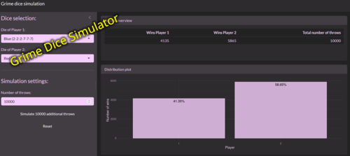
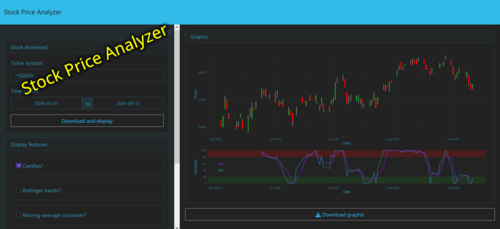
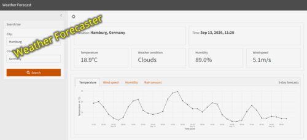
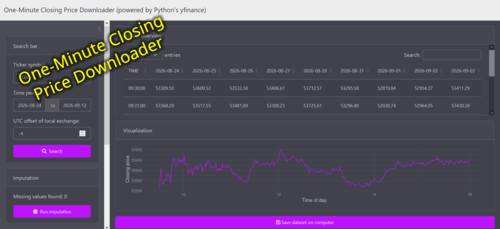
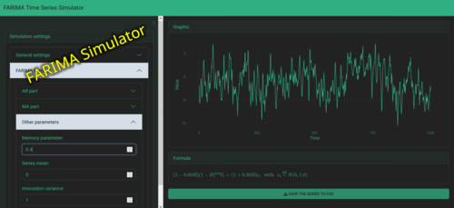

::: {#hero-heading}
Here you can find a selection of my published **software**. Download numbers refer to realized lifetime downloads by the end of Aug 30, 2026.
:::

## R packages

::::::::::::::: pyramid-container
:::::: pyramid
::: first-row
<a href = "https://cran.r-project.org/web/packages/fEGarch/index.html" target="_blank" rel="noopener noreferrer">  </a>
:::

::: second-row
<a href = "https://cran.r-project.org/web/packages/ufRisk/index.html" target="_blank" rel="noopener noreferrer">  </a> <a href = "https://github.com/dschulz13/smardapi" target="_blank" rel="noopener noreferrer">  </a>
:::

::: third-row
<a href = "https://cran.r-project.org/web/packages/smoots/index.html" target="_blank" rel="noopener noreferrer">  </a> <a href = "https://cran.r-project.org/web/packages/esemifar/index.html" target="_blank" rel="noopener noreferrer">  </a> <a href = "https://cran.r-project.org/web/packages/deseats/index.html" target="_blank" rel="noopener noreferrer">  </a>
:::
::::::

:::::::::: {#hexagon-text}
::: {#default-info .info .active}
<h3>Welcome</h3>

<p style="text-align:justify;">

Move your mouse over a package icon to learn more. Click an icon to go to the package's CRAN or GitHub page.

</p>
:::

::: {#smoots .info}
<h3>smoots</h3>

<p>Nonparametric Estimation of the Trend and Its Derivatives in Time Series</p>

<dl>

<dd>[Year:]{.lightbold} 2023</dd>

<dd>[Authors:]{.lightbold} Feng, Y., Letmathe, S., Schulz, D. (Maintainer)</dd>

<dd>[Version:]{.lightbold} 1.1.4</dd>

<dd>[Available on:]{.lightbold} CRAN</dd>

<dd>[Downloads:]{.lightbold} 42,988</dd>

</dl>
:::

::: {#esemifar .info}
<h3>esemifar</h3>

<p>Smoothing Long-Memory Time Series</p>

<dl>

<dd>[Year:]{.lightbold} 2024</dd>

<dd>[Authors:]{.lightbold} Feng, Y., Beran, J., Letmathe, S., Schulz, D. (Maintainer)</dd>

<dd>[Version:]{.lightbold} 2.0.1</dd>

<dd>[Available on:]{.lightbold} CRAN</dd>

<dd>[Downloads:]{.lightbold} 22,230</dd>

</dl>
:::

::: {#deseats .info}
<h3>deseats</h3>

<p>Data-Driven Locally Weighted Regression for Trend and Seasonality in Time Series</p>

<dl>

<dd>[Year:]{.lightbold} 2026</dd>

<dd>[Authors:]{.lightbold} Feng, Y., Schulz, D. (Maintainer)</dd>

<dd>[Version:]{.lightbold} 1.1.2</dd>

<dd>[Available on:]{.lightbold} CRAN</dd>

<dd>[Downloads:]{.lightbold} 12,072</dd>

</dl>
:::

::: {#fegarch .info}
<h3>fEGarch</h3>

<p>Short-Memory/Long-Memory EGARCH & GARCH, VaR/ES Backtesting & Dual Long-Memory Extensions</p>

<dl>

<dd>[Year:]{.lightbold} 2026</dd>

<dd>[Authors:]{.lightbold} Schulz, D. (Maintainer), Feng, Y., Peitz, C., Ayensu, O. K.</dd>

<dd>[Version:]{.lightbold} 1.0.7</dd>

<dd>[Available on:]{.lightbold} CRAN</dd>

<dd>[Downloads:]{.lightbold} 5,461</dd>

</dl>
:::

::: {#smardapi .info}
<h3>smardapi</h3>

<p>Access to the SMARD API of the German Federal Network Agency</p>

<dl>

<dd>[Year:]{.lightbold} 2026</dd>

<dd>[Authors:]{.lightbold} Schulz, D. (Maintainer)</dd>

<dd>[Version:]{.lightbold} 0.1.2</dd>

<dd>[Available on:]{.lightbold} GitHub</dd>

<dd>[Downloads:]{.lightbold} ---</dd>

</dl>
:::

::: {#ufrisk .info}
<h3>ufRisk</h3>

<p>Risk Measure Calculation in Financial Time Series</p>

<dl>

<dd>[Year:]{.lightbold} 2023</dd>

<dd>[Authors:]{.lightbold} Feng, Y., Zhang, X., Peitz, C., Schulz, D., Li, S., Letmathe, S. (Maintainer)</dd>

<dd>[Version:]{.lightbold} 1.0.7</dd>

<dd>[Available on:]{.lightbold} CRAN</dd>

<dd>[Downloads:]{.lightbold} 15,482</dd>

</dl>
:::
::::::::::
:::::::::::::::

```{=html}
<script>
const hexagons = document.querySelectorAll('.hexa');
const infoBoxes = document.querySelectorAll('.info');
const defaultInfo = document.getElementById('default-info');

hexagons.forEach(hexagon => {

hexagon.addEventListener('mouseenter', () => {

// Hide all information
infoBoxes.forEach(info => {
info.classList.remove('active');
});

// Show information belonging to this hexagon
const info = document.getElementById(hexagon.dataset.info);

if (info) {
info.classList.add('active');
}
});

hexagon.addEventListener('mouseleave', () => {

// Hide all information
infoBoxes.forEach(info => {
info.classList.remove('active');
});

// Show default information again
defaultInfo.classList.add('active');
});

});
</script>
```

<br><br>

## R dashboards & R Shiny apps

::::::::::: carousel
<button class="carousel-button left" id="prev">

❮

</button>

::::::::: carousel-viewport
:::::::: {#track .carousel-track}
::: card
<a href="https://schulzd-grime-dice-simulation.share.connect.posit.cloud/" target="_blank" rel="noopener noreferrer">  </a>

<p class="thumb-descr", style="margin-top:8px;">

<strong>Year:</strong> 2026

</p>

<p class="thumb-descr", style="margin-top:-50px;">

<strong>Authors:</strong> Schulz, D.

</p>
:::

::: card
<a href="https://schulzd-stock-price-analyzer.share.connect.posit.cloud/" target="_blank" rel="noopener noreferrer">  </a>

<p class="thumb-descr", style="margin-top:8px;">

<strong>Year:</strong> 2026

</p>

<p class="thumb-descr", style="margin-top:-50px;">

<strong>Authors:</strong> Schulz, D.

</p>
:::

::: card
<a href="https://schulzd-weather-forecaster.share.connect.posit.cloud/" target="_blank" rel="noopener noreferrer">  </a>

<p class="thumb-descr", style="margin-top:8px;">

<strong>Year:</strong> 2026

</p>

<p class="thumb-descr", style="margin-top:-50px;">

<strong>Authors:</strong> Schulz, D.

</p>
:::

::: card
<a href="https://schulzd-one-minute-closing-price-downloader.share.connect.posit.cloud/" target="_blank" rel="noopener noreferrer">  </a>

<p class="thumb-descr", style="margin-top:8px;">

<strong>Year:</strong> 2026

</p>

<p class="thumb-descr", style="margin-top:-50px;">

<strong>Authors:</strong> Schulz, D.

</p>
:::

::: card
<a href="https://schulzd-farima-simulator.share.connect.posit.cloud/" target="_blank" rel="noopener noreferrer">  </a>

<p class="thumb-descr", style="margin-top:8px;">

<strong>Year:</strong> 2026

</p>

<p class="thumb-descr", style="margin-top:-50px;">

<strong>Authors:</strong> Schulz, D.

</p>
:::
::::::::
:::::::::

<button class="carousel-button right" id="next">

❯

</button>

::: {#indicators .carousel-indicators}
:::
:::::::::::

```{=html}
<script>
const track = document.getElementById("track");
const cards = track.querySelectorAll(".card");

const prevButton = document.getElementById("prev");
const nextButton = document.getElementById("next");
const indicators = document.getElementById("indicators");

let currentIndex = 0;


// Create one indicator for each card
cards.forEach((card, index) => {
const indicator = document.createElement("button");

indicator.classList.add("indicator");

indicator.addEventListener("click", () => {
goToSlide(index);
});

indicators.appendChild(indicator);
});


const indicatorElements =
indicators.querySelectorAll(".indicator");


function goToSlide(index) {

// Wrap around when reaching either end
if (index < 0) {
index = cards.length - 1;
}

if (index >= cards.length) {
index = 0;
}

currentIndex = index;

// Move the track
track.style.transform =
`translateX(-${currentIndex * 100}%)`;

// Update indicator
indicatorElements.forEach((indicator, i) => {
indicator.classList.toggle(
"active",
i === currentIndex
);
});
}


nextButton.addEventListener("click", () => {
goToSlide(currentIndex + 1);
});


prevButton.addEventListener("click", () => {
goToSlide(currentIndex - 1);
});


// Initial state
goToSlide(0);
</script>
```

<br><br>

## Python projects

::: panel-tabset
## smard_api

<dl class="stacked-list">

<dt>smardapi (Python Version): Access to the SMARD API of the German Federal Network Agency</dt>

<dd><strong>Year:</strong> 2026</dd>

<dd><strong>Authors:</strong> Schulz, D.</dd>

<dd><strong>Available on:</strong> GitHub</dd>

<dd><strong>Link:</strong> <https://github.com/dschulz13/smardapi_python></dd>

</dl>

## Immo_Webscraper

<dl class="stacked-list">

<dt>Immo_Webscraper: Ein automatisierter Webscraper für ImmobilienScout24 unter Nutzung von Pythons Playwright</dt>

<dd><strong>Year:</strong> 2026</dd>

<dd><strong>Authors:</strong> Schulz, D.</dd>

<dd><strong>Available on:</strong> GitHub</dd>

<dd><strong>Link:</strong> <https://github.com/dschulz13/Immo_Webscraper></dd>

</dl>
:::
